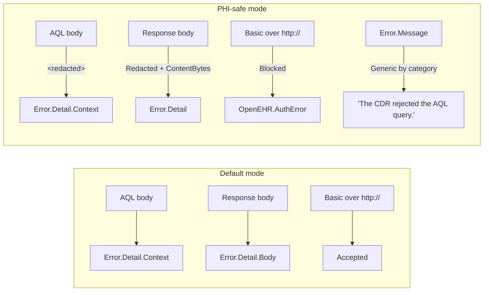

# PHI-safe mode

Available in **v0.1.0**. Engineering flag that narrows what Personally Identifiable / Protected Health Information can travel with connector diagnostics, and hardens the transport against obvious foot-guns.

Enabled per call via the `PhiSafe = true` option on `OpenEHR.Aql`, `OpenEHR.StoredQuery`, and `OpenEHR.Template`.

## What it affects



## Behaviours (what the code actually does)

Implemented in `src/Aql.pqm`.

| Surface                              | Default                              | With `PhiSafe = true`                                                      |
| ------------------------------------ | ------------------------------------ | -------------------------------------------------------------------------- |
| Basic auth over `http://`            | Allowed                              | Refused with `OpenEHR.AuthError` before the request leaves the machine.    |
| `Error.Detail.Body`                  | Parsed JSON or raw body text         | `[ContentBytes = n, Redacted = true]`                                      |
| `Error.Detail.Context`               | AQL text / stored-query name         | `"<redacted>"`                                                             |
| `Error.Message`                      | Server-provided message              | Generic per category (e.g. "The CDR rejected the AQL query.")              |
| `Authorization` in cache key         | Excluded                             | Excluded (same)                                                            |
| `X-Audit-Context` in cache key       | Excluded                             | Excluded (same)                                                            |
| Row-level `Diagnostics.Trace`        | Never                                | Never (same — default-safe)                                                |
| Credentials in function args         | Never accepted                       | Never accepted (same — design invariant)                                   |

The flag narrows what travels with errors. Datasets still fail loudly when the CDR says no; the log just stops carrying content that could identify patients.

## How to enable

Per call:

```m
OpenEHR.Aql(
    "https://cdr.example.org/rest/openehr/v1",
    "SELECT c/uid/value AS Uid FROM EHR e CONTAINS COMPOSITION c",
    [ PhiSafe = true ]
)
```

Set it once at the top of your query file as a variable and reuse across steps to keep queries DRY:

```m
let
    Opts = [ PhiSafe = true, AuditContext = "prod-dashboard" ],
    Uids = OpenEHR.Aql(cdr, sampleAql, Opts),
    Bps  = OpenEHR.StoredQuery(cdr, "org.example::bp_trend", null, Opts)
in
    Table.Combine({Uids, Bps})
```

## What's always on (PHI-safe or not)

These hold unconditionally because they are baked into the connector's design:

- **No row-level tracing.** Page payloads are never written to trace, whatever the trace level.
- **No AQL text at `Information`.** Query text is only traced at `Verbose`.
- **`ExcludedFromCacheKey = {"Authorization", "X-Audit-Context"}`** on every `Web.Contents` call.
- **Credentials via `Extension.CurrentCredential()`** — they cannot leak into a saved `.pbix`.

## Interplay with Power BI tracing

Power BI Desktop writes traces to:

```
%USERPROFILE%\AppData\Local\Microsoft\Power BI Desktop\Traces\
```

Even with `PhiSafe = true`, **the Mashup engine itself** may emit row counts and schema info at Verbose. If you are threat-modelling the trace directory, treat the whole directory as sensitive and rotate it off the host.

## Deferred (post-v0.1.0)

- AQL-body SHA-256 prefix in traces (replace the `Verbose` full-text emission).
- Stable pseudonyms for nav-table `ehr_id` folder names.
- `QueryParameters` key-only tracing.

These land in Phase 3 once the trace layer itself is overhauled.

## Related

- [Options reference — `PhiSafe`](../reference/options.md)
- [Error codes](../reference/error-codes.md)
- [Troubleshooting — reading `mashup-trace.json`](../troubleshooting.md)

[← Back to Home](../index.md)
