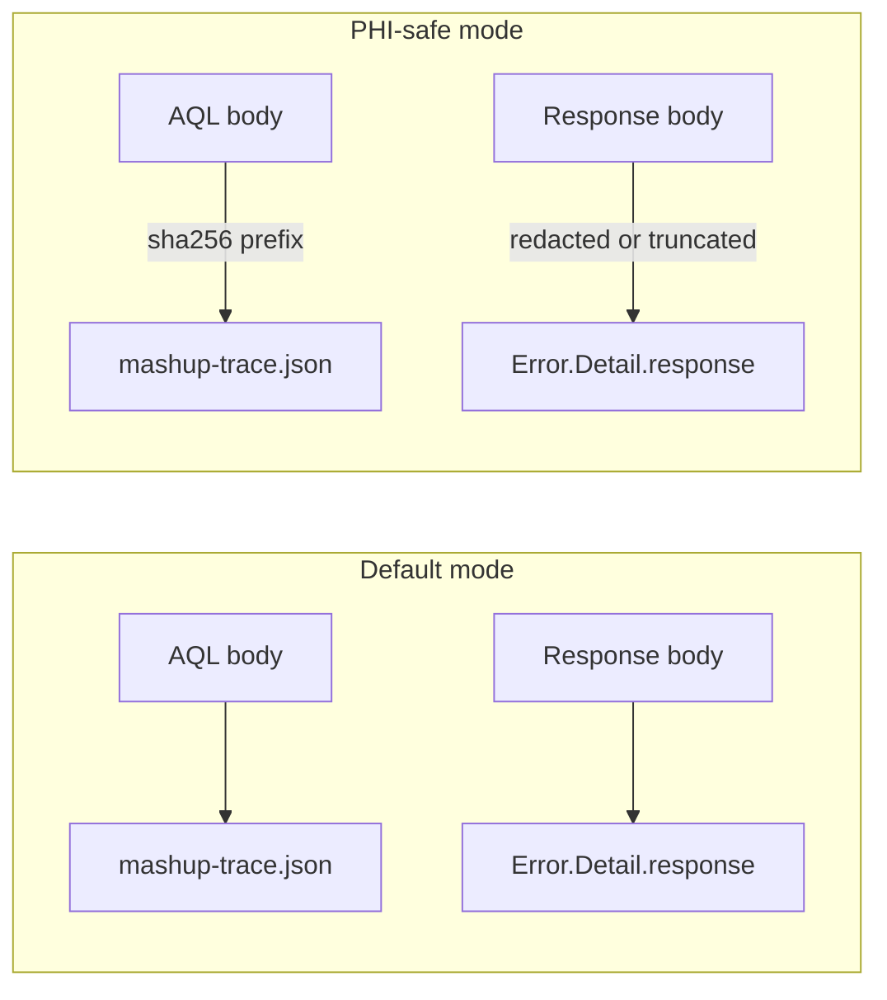

# PHI-safe mode

Engineering flag that reduces the surface area of Personally Identifiable / Protected Health Information in connector-emitted diagnostics. **Planned for Phase 2** — not present in `v0.1.0`. This page describes the intended behaviour so integrators can plan around it.

## What it affects



## Guarantees in `v0.1.0` already

These hold **today**, with or without PHI-safe mode:

- **No row-level `Diagnostics.Trace`.** Page payloads are never written to trace, whatever the trace level.
- **No query bodies at `Information`.** AQL text is only traced at `Verbose`, never the default.
- **No `Authorization` caching.** `ExcludedFromCacheKey = {"Authorization"}` on every `Web.Contents` call.
- **Credentials never in function args.** The connector reads them via `Extension.CurrentCredential()` at call time — they cannot leak into a saved `.pbix`.

## What PHI-safe mode will add (Phase 2)

| Surface                       | Default                                      | PHI-safe mode                                           |
| ----------------------------- | -------------------------------------------- | ------------------------------------------------------- |
| AQL body in trace             | Full text at `Verbose`                       | SHA-256 prefix + character count only                   |
| Response body in error record | Up to 16 KB verbatim                         | Content-Type + byte count only                          |
| `QueryParameters` values      | Full values at `Verbose`                     | Keys only; values replaced with `<redacted>`            |
| Nav-table folder names        | `ehr_id` GUIDs                               | Stable pseudonyms (HMAC of GUID with a per-session salt) |
| `Error.Message`               | Server-provided message                      | Generic by reason family                                |

## How to enable (proposed)

A new connector-level option, read once per session:

```m
// At the top of src/OpenEHR.pq
OpenEHR.Options = [
    PhiSafe = true
];
```

Flipping this flag does **not** silence errors — it narrows what travels with them. Your dataset still fails loudly when the CDR says no; the log just stops carrying content that could identify patients.

## Interplay with Power BI tracing

Power BI Desktop writes traces to:

```
%USERPROFILE%\AppData\Local\Microsoft\Power BI Desktop\Traces\
```

Even with PHI-safe mode on, **the Mashup engine itself** may emit row counts and schema info at Verbose. If you are threat-modelling the trace directory, treat the whole directory as sensitive and rotate it off the host.

## Related

- [Error codes](../reference/error-codes.md)
- [Options reference](../reference/options.md)
- [Troubleshooting — reading `mashup-trace.json`](../troubleshooting.md)

[← Back to Home](../index.md)
