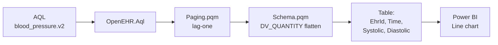

# Blood-pressure trend

End-to-end recipe: AQL → connector → Power BI line chart of systolic / diastolic over time, grouped by patient. Verified against the canonical `openEHR-EHR-OBSERVATION.blood_pressure.v2` archetype seeded by `dev/scripts/load-seed.sh`.

## Pipeline



## The query

```sql
SELECT
    e/ehr_id/value                                                   AS EhrId,
    o/data[at0001]/events[at0006]/time/value                         AS Time,
    o/data[at0001]/events[at0006]/data[at0003]/items[at0004]/value   AS Systolic,
    o/data[at0001]/events[at0006]/data[at0003]/items[at0005]/value   AS Diastolic
FROM EHR e
    CONTAINS COMPOSITION c
        CONTAINS OBSERVATION o [openEHR-EHR-OBSERVATION.blood_pressure.v2]
ORDER BY o/data[at0001]/events[at0006]/time/value ASC
```

!!! note "Always alias"
    Without `AS`, the connector sees columns named `#0`, `#1`, … — stable across refreshes but meaningless in report visuals.

## Power Query

```m
let
    Cdr  = "http://localhost:8080/ehrbase/rest/openehr/v1",

    Aql  = "
        SELECT
            e/ehr_id/value                                                 AS EhrId,
            o/data[at0001]/events[at0006]/time/value                       AS Time,
            o/data[at0001]/events[at0006]/data[at0003]/items[at0004]/value AS Systolic,
            o/data[at0001]/events[at0006]/data[at0003]/items[at0005]/value AS Diastolic
        FROM EHR e
            CONTAINS COMPOSITION c
                CONTAINS OBSERVATION o [openEHR-EHR-OBSERVATION.blood_pressure.v2]
        ORDER BY o/data[at0001]/events[at0006]/time/value ASC
    ",

    Raw  = OpenEHR.Aql(Cdr, Aql, [ PageSize = 500, ExpandRmObjects = true ]),

    // Systolic / Diastolic are DV_QUANTITY → flattened to Systolic.magnitude, etc.
    // Keep only what the chart needs.
    Trim = Table.SelectColumns(Raw, {
        "EhrId",
        "Time",
        "Systolic.magnitude",
        "Diastolic.magnitude"
    }),

    Ren  = Table.RenameColumns(Trim, {
        {"Systolic.magnitude",  "Systolic"},
        {"Diastolic.magnitude", "Diastolic"}
    }),

    Typed = Table.TransformColumnTypes(Ren, {
        {"EhrId",     type text},
        {"Time",      type datetimezone},
        {"Systolic",  Int64.Type},
        {"Diastolic", Int64.Type}
    })
in
    Typed
```

## Visual

1. **Line chart** visual in the report canvas.
2. **X-axis:** `Time` (continuous; set *Type* → *Continuous*).
3. **Y-axis:** `Systolic`, `Diastolic`.
4. **Legend:** `EhrId`.
5. **Slicer:** `EhrId` dropdown so clinicians can isolate one patient.

## Hypertension threshold

Add a calculated column for an at-a-glance flag:

```m
// In the same query, after Typed:
Flag = Table.AddColumn(Typed, "Class", each
    if [Systolic] >= 140 or [Diastolic] >= 90 then "Hypertensive"
    else if [Systolic] >= 130 or [Diastolic] >= 80 then "Elevated"
    else "Normal", type text)
```

Use **Class** as the line colour to split the trend.

## Incremental refresh

The query is pre-ordered by time, so wiring it into [Incremental refresh](incremental-refresh.md) is a small delta — swap the full-range query for one parameterised on `RangeStart` / `RangeEnd`.

## Troubleshooting

- **Columns `Systolic.magnitude` / `Systolic.units`**: expected. `DV_QUANTITY` flattens into `magnitude`, `units`, `precision`. If you want the raw record back, pass `ExpandRmObjects = false`.
- **Empty table**: confirm the seed ran — `bash dev/scripts/load-seed.sh`. On the public sandbox, use a different archetype that is definitely seeded (see [EHRbase notes](cdr-vendor-notes/ehrbase.md)).
- **`OpenEHR.AqlError` on the template path**: double-check the archetype id — EHRbase is strict about the template being uploaded before the query is accepted.

[← Back to Home](../index.md)
