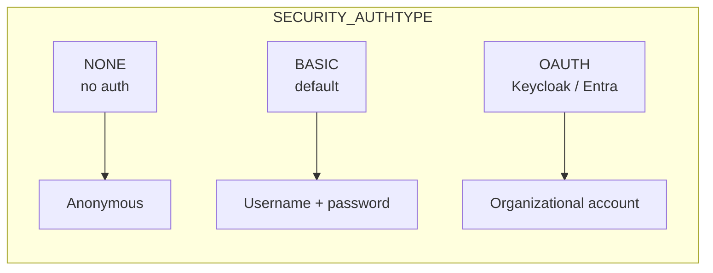

# EHRbase notes

Quirks, behaviours, and known-working versions for the [EHRbase](https://github.com/ehrbase/ehrbase) open-source CDR. This is the only CDR officially supported by `v0.1.0`.

## Versions

| Component     | Version tested | Notes                                                                 |
| ------------- | -------------- | --------------------------------------------------------------------- |
| EHRbase       | **2.15.x**     | Pinned in `dev/docker-compose.yml`. 2.14 and 2.16 also work in CI.    |
| PostgreSQL    | **16**         | EHRbase 2.x requires 15+. 14 is not supported.                        |
| Java          | 21 (container) | Distroless JRE in the official image.                                 |
| Spring Boot   | 3.x            | Drives the env-var naming below.                                      |

## Base URL

```
http://<host>:8080/ehrbase/rest/openehr/v1
```

The connector requires **no trailing slash**. `Web.Contents` builds `/query/aql`, `/query/{qname}`, `/ehr`, `/definition/template/adl1.4` off that base.

## Environment variables that matter

`dev/docker-compose.yml` sets these — mirror them when running EHRbase elsewhere:

```yaml
SPRING_DATASOURCE_URL:      jdbc:postgresql://postgres:5432/ehrbase
SPRING_DATASOURCE_USERNAME: ehrbase_restricted
SPRING_DATASOURCE_PASSWORD: ehrbase_restricted
SPRING_FLYWAY_USER:         ehrbase
SPRING_FLYWAY_PASSWORD:     ehrbase
SECURITY_AUTHTYPE:          BASIC          # or NONE / OAUTH
SECURITY_AUTHUSER:          ehrbase
SECURITY_AUTHPASSWORD:      ehrbase
SECURITY_AUTHADMINUSER:     ehrbase-admin
SECURITY_AUTHADMINPASSWORD: ehrbase-admin
SERVER_NODENAME:            local.ehrbase.org
```

!!! warning "Legacy env-var names"
    Pre-2.x EHRbase used `DB_URL` / `DB_USER` / `DB_PASS`. Spring Boot ignores those. If you see `NullPointerException` at startup, you are on the legacy names.

## Authentication modes



- **`BASIC`** — see [Basic auth](../../auth/basic.md). Two roles: `AUTHUSER` (read/write EHRs + queries) and `AUTHADMINUSER` (templates, stored queries, deletes).
- **`OAUTH`** — requires a front-door IDP (Keycloak, Auth0, Entra). EHRbase validates bearer tokens via JWK set. See [OAuth PKCE](../../auth/oauth-pkce.md).
- **`NONE`** — dev only. Accepts any request without `Authorization`.

## Polymorphic JSON quirks

EHRbase's Jackson deserialiser is strict about `_type` discriminators on polymorphic RM objects:

| Field         | Must include `_type`                                        |
| ------------- | ----------------------------------------------------------- |
| `subject`     | `PARTY_SELF`, `PARTY_IDENTIFIED`, or `PARTY_RELATED`        |
| `external_ref`| `PARTY_REF`                                                 |
| `id` (in external_ref)| `GENERIC_ID`, `HIER_OBJECT_ID`, or `OBJECT_VERSION_ID` |

Missing `_type` fails with `Cannot construct instance of <class> (no Creators, …)`. The seed scripts in `dev/scripts/load-seed.sh` include the markers correctly — use them as a reference.

## Stored queries

EHRbase accepts the standard `PUT /definition/query/{qualifiedName}/{version}` shape:

```bash
curl -u ehrbase-admin:ehrbase-admin \
  -H 'Content-Type: application/json' \
  -X PUT "http://localhost:8080/ehrbase/rest/openehr/v1/definition/query/org.openehr::compositions/1.0.0" \
  --data '{"type":"AQL","q":"SELECT c/uid/value FROM EHR e CONTAINS COMPOSITION c"}'
```

The connector then surfaces it under **Navigator → Stored Queries → org.openehr::compositions**.

## Known limitations in v0.1.0

- **`WHERE EXISTS` on `EHR_STATUS`** — older EHRbase versions (< 2.10) reject certain predicate shapes. 2.15+ is fine.
- **CONTAINS ordering** — `CONTAINS` is not commutative in EHRbase. Write `EHR CONTAINS COMPOSITION CONTAINS OBSERVATION`, not the reverse.
- **Template matching by path** — path-based archetype ids (e.g. `[openEHR-EHR-OBSERVATION.blood_pressure.v2]`) require the template to be uploaded *before* the query executes.

## Public sandbox

EHRbase hosts a shared sandbox at `https://sandkiste.ehrbase.org/ehrbase/rest/openehr/v1`. Credentials and rate-limit policy are documented at <https://ehrbase.org/sandbox>. Don't flood it — it is shared with the whole community.

## Useful endpoints when debugging

| Endpoint                                          | Purpose                                   |
| ------------------------------------------------- | ----------------------------------------- |
| `GET /ehrbase/management/info`                    | Build / version info.                     |
| `GET /ehrbase/management/health`                  | Liveness + readiness.                     |
| `GET /ehrbase/rest/openehr/v1/definition/template/adl1.4` | List installed OPTs.              |
| `GET /ehrbase/rest/openehr/v1/definition/query`   | List stored queries.                      |

## Related

- [EHRbase on GitHub](https://github.com/ehrbase/ehrbase)
- [openEHR REST EHR spec](https://specifications.openehr.org/releases/ITS-REST/latest/ehr.html)
- [openEHR REST definitions spec](https://specifications.openehr.org/releases/ITS-REST/latest/definition.html)

[← Back to Home](../../index.md)
