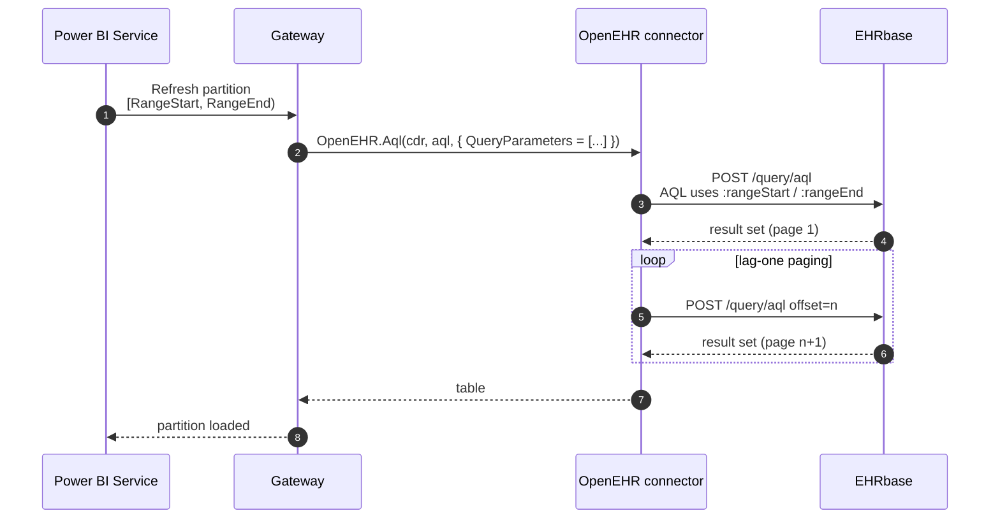

# Incremental refresh

Power BI incremental refresh is a first-class scenario for this connector. The pattern: declare two date-time parameters called `RangeStart` / `RangeEnd`, push them into your AQL via the `QueryParameters` option, and let the service partition the dataset by date.

## When to reach for it

- CDR holds several years of data; a full refresh takes minutes or more.
- You want near-real-time dashboards (hourly partition) without re-scanning archives every refresh.
- Your Power BI capacity has dataset-size limits you are approaching.

## Flow



## Step 1 — AQL with named parameters

```sql
SELECT
    c/uid/value                       AS Uid,
    c/context/start_time/value        AS StartTime,
    o/data[at0001]/events[at0006]/time/value                         AS ObsTime,
    o/data[at0001]/events[at0006]/data[at0003]/items[at0004]/value   AS Systolic
FROM EHR e
    CONTAINS COMPOSITION c
        CONTAINS OBSERVATION o [openEHR-EHR-OBSERVATION.blood_pressure.v2]
WHERE c/context/start_time/value >= :rangeStart
  AND c/context/start_time/value <  :rangeEnd
ORDER BY c/context/start_time/value ASC
```

!!! info "`query_parameters` — with underscore"
    The openEHR spec field is `query_parameters` (underscore). Earlier drafts used `query-parameters` (hyphen). The connector's `QueryParameters` option emits the correct underscore form.

## Step 2 — parameters in Power Query

**Home → Manage parameters → New parameter**, twice:

| Name         | Type        | Required | Current value            |
| ------------ | ----------- | -------- | ------------------------ |
| `RangeStart` | Date/Time   | Yes      | `2024-01-01 00:00:00`    |
| `RangeEnd`   | Date/Time   | Yes      | `2024-01-02 00:00:00`    |

## Step 3 — pass them through

```m
let
    Cdr = "http://localhost:8080/ehrbase/rest/openehr/v1",

    Aql = "
        SELECT
            c/uid/value                AS Uid,
            c/context/start_time/value AS StartTime,
            o/data[at0001]/events[at0006]/time/value                       AS ObsTime,
            o/data[at0001]/events[at0006]/data[at0003]/items[at0004]/value AS Systolic
        FROM EHR e
            CONTAINS COMPOSITION c
                CONTAINS OBSERVATION o [openEHR-EHR-OBSERVATION.blood_pressure.v2]
        WHERE c/context/start_time/value >= :rangeStart
          AND c/context/start_time/value <  :rangeEnd
        ORDER BY c/context/start_time/value ASC
    ",

    Source = OpenEHR.Aql(Cdr, Aql, [
        PageSize        = 1000,
        ExpandRmObjects = true,
        QueryParameters = [
            rangeStart = DateTime.ToText(RangeStart, "yyyy-MM-ddTHH:mm:ss"),
            rangeEnd   = DateTime.ToText(RangeEnd,   "yyyy-MM-ddTHH:mm:ss")
        ]
    ])
in
    Source
```

Power BI substitutes `RangeStart` / `RangeEnd` per partition; the connector marshals those values into the request body's `query_parameters`.

## Step 4 — configure the incremental policy

Right-click the table → **Incremental refresh**:

- **Archive data starting**: e.g. 3 years before refresh date.
- **Incrementally refresh data starting**: e.g. 14 days before refresh date.
- **Detect data changes**: off for append-only CDRs; on if compositions can be amended and you have a stable change-tracking column.

## Gotchas

- **Timezone handling** — openEHR times are ISO-8601 with offset. `DateTime.ToText(.., "yyyy-MM-ddTHH:mm:ss")` strips the zone. If your CDR is in UTC (EHRbase default) this is fine; otherwise, emit `"o"` round-trip format.
- **Partition overlap** — AQL `<` on `:rangeEnd` prevents double-counting at partition boundaries. Using `<=` will duplicate compositions at the midnight boundary.
- **First refresh is still full** — the service does a *historical* pass on first publish, then switches to incremental. Budget time for that initial run.
- **Schema drift** — if RM flattening produces different column sets across partitions (rare but possible with sparse data), add explicit type coercion after the source step so merged partitions don't clash.

## Related

- [Blood-pressure trend](blood-pressure-trend.md) — the full-range variant this recipe extends.
- [Options reference — `QueryParameters`](../reference/options.md)
- [Power BI incremental refresh docs](https://learn.microsoft.com/power-bi/connect-data/incremental-refresh-overview)

[← Back to Home](../index.md)
