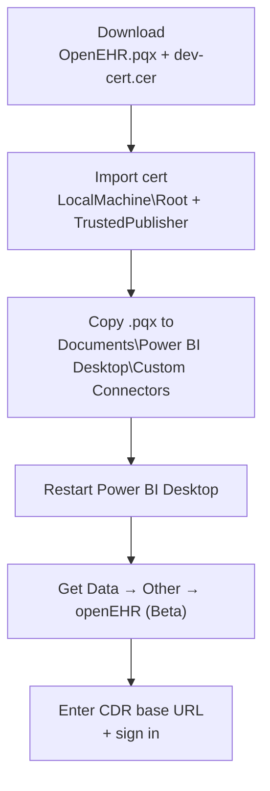

# End-user install

Step-by-step guide for **analysts** loading the connector on a personal Windows workstation. For gateway installs, see [Gateway admin install](install-gateway-admin.md).

## What you need

- Windows 10 or 11 with local admin rights.
- **Power BI Desktop** (Win32 installer build — the Microsoft Store build does not load custom connectors).
- Network access to your Clinical Data Repository — default EHRbase base URL is `http://<host>:8080/ehrbase/rest/openehr/v1`.

## The flow at a glance



## 1. Download the release

From the latest [GitHub Release](https://github.com/rubentalstra/powerbi-openehr-aql/releases) grab:

| File              | Purpose                                      |
| ----------------- | -------------------------------------------- |
| `OpenEHR.pqx`     | The signed connector.                        |
| `dev-cert.cer`    | The public cert — trust this once.           |
| `SHA256SUMS.txt`  | Verify integrity before installing.          |

Verify checksums in an elevated PowerShell prompt:

```powershell
Get-FileHash .\OpenEHR.pqx -Algorithm SHA256
Get-Content .\SHA256SUMS.txt | Select-String OpenEHR.pqx
```

## 2. Trust the publisher (one-time)

v0.1.0 ships with a **self-signed** cert. Full rationale + future plan on [Self-signed cert install](install-self-signed.md).

```powershell
Import-Certificate -FilePath .\dev-cert.cer -CertStoreLocation Cert:\LocalMachine\Root
Import-Certificate -FilePath .\dev-cert.cer -CertStoreLocation Cert:\LocalMachine\TrustedPublisher
```

## 3. Install the connector

```powershell
$dest = "$env:USERPROFILE\Documents\Power BI Desktop\Custom Connectors"
New-Item -ItemType Directory -Force -Path $dest | Out-Null
Copy-Item .\OpenEHR.pqx -Destination $dest -Force
```

## 4. Power BI Desktop settings

**File → Options → Security → Data Extensions** must be set to:

> **(Recommended) Allow any extension to load without validation or warning**

If your IT policy blocks that, use the fully-validated self-signed path from [install-self-signed.md](install-self-signed.md) — no setting change required.

## 5. First sign-in

1. Fully quit and relaunch Power BI Desktop.
2. **Get Data → Other → openEHR (Beta) → Connect**.
3. Enter your CDR base URL, e.g. `http://localhost:8080/ehrbase/rest/openehr/v1`.
4. Choose an authentication method:
    - **Username and password** — [Basic auth](../auth/basic.md)
    - **Organizational account (OAuth)** — [OAuth PKCE](../auth/oauth-pkce.md) / [Entra ID](../auth/entra-id.md)
5. The **Navigator** opens with four folders: **Ad-hoc AQL**, **Stored Queries**, **Templates**, **EHRs**.

## Uninstalling

```powershell
Remove-Item "$env:USERPROFILE\Documents\Power BI Desktop\Custom Connectors\OpenEHR.pqx"
# Optional: also remove cached credentials in Power BI Desktop
# File → Options → Data source settings → Global permissions → Clear
```

## Next steps

- **Write your first query** — [Blood-pressure trend cookbook](../cookbook/blood-pressure-trend.md).
- **Schedule refresh** — [Gateway admin install](install-gateway-admin.md) (ask your IT team).
- **Something's wrong** — [Troubleshooting](../troubleshooting.md).

[← Back to Home](../index.md)
