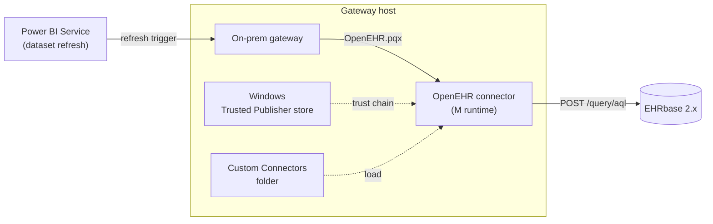
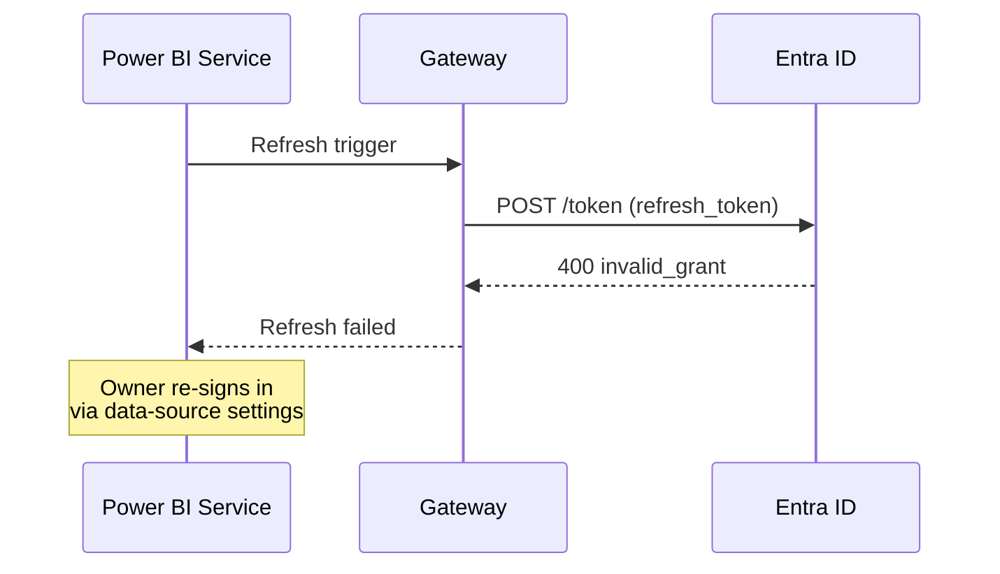

# Gateway admin install

How to install `OpenEHR.pqx` on an on-premises Power BI data gateway so that published reports can refresh on a schedule.

!!! warning "Gateway mode"
    Custom connectors work only on the **on-premises data gateway — standard mode**. The VNet/personal gateway and the Power BI *Service*-embedded runtime both reject custom connectors.

## Architecture



## Prerequisites

- On-premises data gateway **standard mode**, minimum version 3000.100.x (custom-connector support is GA since 2021, but stick to a current release).
- Gateway host has network reach to your CDR.
- Local admin on the gateway host — trust-store edits require elevation.
- Same `OpenEHR.pqx` + `dev-cert.cer` that your analysts installed.

## 1. Place the connector

Create the custom-connectors folder and drop the `.pqx` in:

```powershell
$dest = "C:\Program Files\On-premises data gateway\CustomConnectors"
# or: $env:ALLUSERSPROFILE + "\Microsoft\On-premises data gateway\CustomConnectors"
New-Item -ItemType Directory -Force -Path $dest | Out-Null
Copy-Item .\OpenEHR.pqx -Destination $dest -Force
```

In the gateway app (**On-premises data gateway → Connectors**), set the **Custom data connectors folder** to that path and click **Apply**.

## 2. Trust the publisher

```powershell
Import-Certificate -FilePath .\dev-cert.cer -CertStoreLocation Cert:\LocalMachine\Root
Import-Certificate -FilePath .\dev-cert.cer -CertStoreLocation Cert:\LocalMachine\TrustedPublisher
```

Restart the gateway Windows service (`Restart-Service PBIEgwService`) so the trust store is re-read.

## 3. Register the data source in the Power BI service

1. <https://app.powerbi.com> → gear icon → **Manage connections and gateways**.
2. Pick your gateway cluster → **+ New** data source.
3. **Data source type:** openEHR.
4. **CDR base URL:** same URL the analyst entered in Desktop.
5. **Authentication method:**
    - **Basic** — service-account username/password.
    - **OAuth 2.0** — click **Edit credentials**, sign in interactively as the refresh principal (a dedicated user, ideally not a person's primary account).

## 4. Schedule refresh

1. In the dataset's settings, set **Gateway connection** to *your* gateway.
2. Expand **Data source credentials** — sign in if not already done.
3. Under **Scheduled refresh**, pick a cadence. Recommended: start with once daily during off-hours, then scale up as you learn the CDR's load tolerance.

## 5. Verify

From the dataset settings, click **Refresh now**. Then:

```powershell
# On the gateway host — recent errors
Get-Content "C:\Users\PBIEgwService\AppData\Local\Microsoft\On-premises data gateway\Report\Mashup-*.log" -Tail 200
```

You should see `Web.Request` entries hitting `/query/aql` on your CDR base URL.

## OAuth refresh-token lifetime

Entra ID default refresh-token lifetime is 90 days inactivity (policy may tighten this). When it expires:



Set a reminder ~80 days after each sign-in, or use an identity that does not expire (managed identity — not supported by this connector today; see [Client credentials](../auth/client-credentials.md) for patterns).

## Troubleshooting

| Symptom                                                          | Likely cause                                                                              |
| ---------------------------------------------------------------- | ----------------------------------------------------------------------------------------- |
| `The extension 'OpenEHR' could not be loaded. Signature invalid` | `dev-cert.cer` not imported to `LocalMachine\TrustedPublisher` on the gateway host.       |
| `Credentials are required to connect`                            | OAuth refresh token expired. Owner must re-sign-in via dataset → data-source credentials. |
| Refresh starts, then hangs indefinitely                          | CDR reachable from analyst's laptop but not from gateway host (firewall / routing).       |
| `TestConnection` error in gateway log                            | Running an unofficial build without `TestConnection`. Use the release build.              |

## Related

- [End-user install](install-end-user.md)
- [Self-signed cert install](install-self-signed.md)
- [OAuth PKCE](../auth/oauth-pkce.md)

[← Back to Home](../index.md)
