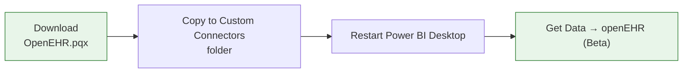

# Signed-cert install (future)

Once the project ships releases signed with a **commercial OV or EV code-signing certificate** (Sectigo, DigiCert, SSL.com, …), this page will document the trusted-publisher install flow — no manual `.cer` import, no `TrustedPublisher` store edits.

## How the flow will look

No cert import, because the signature chains to a Microsoft-trusted Certificate Authority already shipped with Windows.

## Why not yet?

- An **OV** code-signing cert runs roughly US$300–600/year.
- An **EV** cert (skips SmartScreen reputation build-up) runs US$600–1200/year and requires a hardware token.
- The project wants to validate traction before taking on that annual cost.

Track progress on the [ROADMAP](https://github.com/rubentalstra/powerbi-openehr-aql/blob/main/ROADMAP.md) or sponsor via the [FUNDING](https://github.com/rubentalstra/powerbi-openehr-aql/blob/main/.github/FUNDING.yml) page.

## Today

For `v0.1.0` use [Self-signed cert install](install-self-signed.md). The only extra step is a one-time `Import-Certificate` to populate `LocalMachine\Root` and `LocalMachine\TrustedPublisher`.

[← Back to Home](../index.md)
