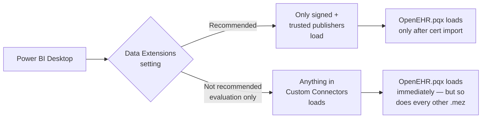

# Unsigned / evaluation install

Fastest path to try the connector — tells Power BI Desktop to load any custom connector in the folder, signed or not. Use only for short evaluations on a disposable workstation.

!!! danger "Security implication"
    This setting relaxes the global trust check for **every** custom connector in your Custom Connectors folder — not just this one. For anything beyond a quick smoke test, follow the [Self-signed cert install](install-self-signed.md) instead — same outcome, no weakened security posture.

## 1. Grab the `.mez` or `.pqx`

From the latest [GitHub Release](https://github.com/rubentalstra/powerbi-openehr-aql/releases) download `OpenEHR.pqx`. (If you built locally you may have a `.mez` instead — same shape.)

## 2. Drop the file into place

```powershell
$dest = "$env:USERPROFILE\Documents\Power BI Desktop\Custom Connectors"
New-Item -ItemType Directory -Force -Path $dest | Out-Null
Copy-Item .\OpenEHR.pqx -Destination $dest -Force
```

## 3. Relax the data-extensions check

**File → Options → Security → Data Extensions →**
**"(Not recommended) Allow any extension to load without validation or warning"**



## 4. Restart and connect

1. Fully quit and relaunch Power BI Desktop.
2. **Get Data → Other → openEHR (Beta)**.
3. Enter the CDR base URL and credentials.

## Limitations

- **Does not work on the gateway.** The on-premises gateway always requires signed connectors with trusted-publisher certs. See [Gateway admin install](install-gateway-admin.md).
- **Does not survive Desktop reinstall.** The setting is per-installation.
- **SmartScreen** may still flag the file on first open. Choose *Run anyway*.

## When you're ready to move off this mode

Follow [Self-signed cert install](install-self-signed.md) — import the publisher cert once, flip the Data Extensions setting back to *Recommended*, done.

[← Back to Home](../index.md)
