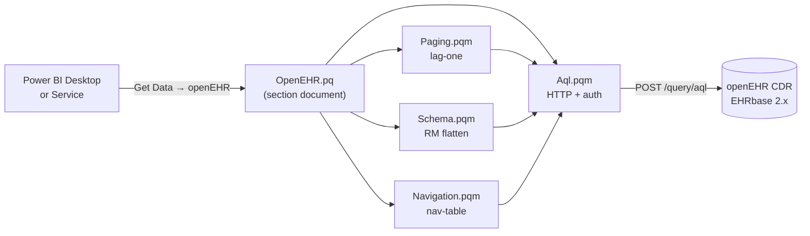

# powerbi-openehr-aql

A native Power BI custom data connector for openEHR [Archetype Query Language (AQL)](https://specifications.openehr.org/releases/QUERY/latest/AQL.html).

Run AQL against an openEHR Clinical Data Repository directly from Power BI Desktop. Pagination, Reference-Model flattening, and Power BI Service refresh through the on-premises gateway are handled for you.

!!! warning "Pre-release"
    `v0.1.0` is the public tester target for **EHRbase 2.x + Basic auth + AQL**. OAuth and non-EHRbase CDRs remain experimental until they are validated end to end.

## How it fits together

```mermaid
flowchart LR
    A["Power BI Desktop<br/>or Service"] -->|Get Data → openEHR| B["OpenEHR.pq<br/>(section document)"]
    B --> C["Aql.pqm<br/>HTTP + auth"]
    B --> D["Paging.pqm<br/>lag-one"]
    B --> E["Schema.pqm<br/>RM flatten"]
    B --> F["Navigation.pqm<br/>nav-table"]
    C -->|POST /query/aql| G[("openEHR CDR<br/>EHRbase 2.x")]
    D --> C
    E --> C
    F --> C
```

## 60-second install

1. Download the signed `OpenEHR.pqx` (and `dev-cert.cer`) from the latest [GitHub Release](https://github.com/rubentalstra/powerbi-openehr-aql/releases).
2. Run `install-powerbi-connector.ps1` from an elevated PowerShell prompt — see [Self-signed cert install](getting-started/install-self-signed.md).
3. The installer copies `OpenEHR.pqx` to `Documents\Microsoft Power BI Desktop\Custom Connectors` and trusts the signing thumbprint.
4. Restart Power BI Desktop → **Get Data → Other → openEHR (Beta)**.
5. For local validation, connect to `http://localhost:8080/ehrbase/rest/openehr/v1` with Basic auth (`ehrbase` / `ehrbase`).

## Why this connector

- **Native AQL, not a SQL bridge.** Queries go straight to `/query/aql`, so archetype-bound semantics are preserved.
- **RM-aware flattening.** `DV_QUANTITY`, `DV_CODED_TEXT`, `DV_DATE_TIME`, `DV_IDENTIFIER`, and similar shapes become scalar columns.
- **Lag-one pagination.** Large result sets stream rather than failing on hard limits.
- **Service-safe.** `TestConnection` is implemented; `Web.Contents` base URLs are static; `ExcludedFromCacheKey = {"Authorization"}` keeps rotating tokens from poisoning the cache.
- **Zero PHI in logs.** No row-level `Diagnostics.Trace`; no query bodies at `Information`.

## Where to go next

- **Analyst** — [End-user install](getting-started/install-end-user.md), then the [Blood-pressure cookbook](cookbook/blood-pressure-trend.md).
- **Gateway admin** — [Gateway admin install](getting-started/install-gateway-admin.md).
- **Developer / integrator** — [Functions](reference/functions.md), [Options](reference/options.md), [Error codes](reference/error-codes.md).
- **Auth setup** — [Basic](auth/basic.md), [OAuth PKCE](auth/oauth-pkce.md), [Entra ID](auth/entra-id.md).
- **Something broken** — [Troubleshooting](troubleshooting.md).
