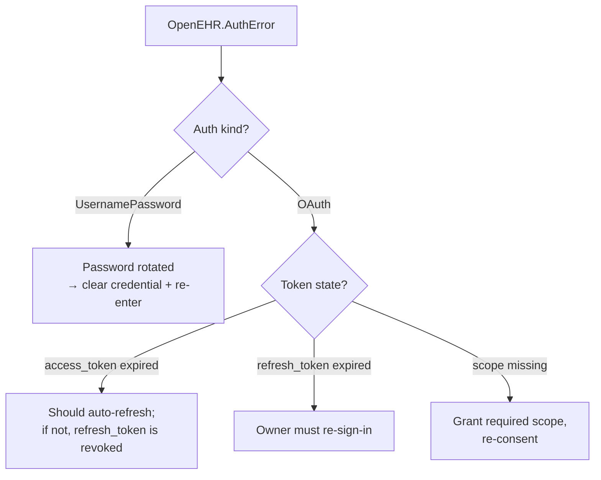

# Error codes

Every error surfaced by this connector uses an `OpenEHR.*` reason family. Reasons are stable across versions — you can pattern-match on them in downstream Power Query steps with `try … otherwise`.

## Quick table

| Reason                    | HTTP trigger    | Meaning                                                          |
| ------------------------- | --------------- | ---------------------------------------------------------------- |
| `OpenEHR.AqlError`        | 400             | Server rejected the AQL (syntax, unknown archetype, …).          |
| `OpenEHR.AuthError`       | 401, 403        | Credentials missing, wrong, or insufficient.                     |
| `OpenEHR.TimeoutError`    | 408 or wall-clock | Server took longer than `Timeout`.                             |
| `OpenEHR.ConflictError`   | 409             | State conflict (duplicate template, modified composition, …).    |
| `OpenEHR.NotFoundError`   | 404             | Resource does not exist on the CDR.                              |
| `OpenEHR.HttpError`       | any other 4xx/5xx | Unexpected HTTP error — see `Details.response`.                |

## Error record shape

```m
[
    Reason  = "OpenEHR.AqlError",
    Message = "The CDR rejected the AQL query. Verify syntax and that referenced archetypes are installed.",
    Detail  = [
        status   = 400,
        request  = [
            method     = "POST",
            relativeUrl = "query/aql"
        ],
        response = [
            #"Content-Type" = "application/json",
            body            = "{\"error\":\"Parse error at position 42\"}"
        ]
    ]
]
```

!!! warning "`Detail.response.body` is raw"
    The response body is passed through verbatim so you can diagnose vendor-specific errors. For EHRbase, it is a JSON record with `error` / `message`; for other CDRs the shape differs.

## Per-reason guidance

### `OpenEHR.AqlError`

Almost always user-authored AQL. Common root causes:

- **Missing `AS` alias** — columns come back as `#0`, `#1`, … stable but unnamed.
- **`CONTAINS` ordering** — EHRbase is strict: `EHR CONTAINS COMPOSITION CONTAINS OBSERVATION`, not reverse.
- **Archetype / template not installed** — upload the OPT (`dev/scripts/load-seed.sh`) before querying.
- **Un-quoted path segments** — `[at0001]` node-ids and `[openEHR-EHR-…]` archetype-ids live in `[ ]` brackets.

### `OpenEHR.AuthError`

Whichever auth kind is active, the token or credential is no longer valid:



Clear credentials at **File → Options → Data source settings → Global permissions → Clear permissions**.

### `OpenEHR.TimeoutError`

Either the CDR is slow or the query is expensive. Tactics:

- Add a `WHERE` clause with a time window.
- Use a [stored query](functions.md#openehrstoredquerycdrbaseurl-qualifiedname-version-options-as-table) — the CDR may plan it better than an ad-hoc body.
- Lower `PageSize` so individual round-trips are quicker (at the cost of more of them).
- Raise `Timeout` if the slow page is still useful.

### `OpenEHR.NotFoundError`

- Wrong base URL — `http://host:8080/ehrbase/rest/openehr/v1` (no trailing slash, `v1` matters).
- Stored-query name + version combination is not registered.
- Tenant isolation — the caller's identity does not have access to any EHRs that match the query.

### `OpenEHR.ConflictError`

Vendor-specific. On EHRbase, usually:

- Uploading an OPT that already exists — idempotent `PUT` is not supported on every endpoint.
- Modifying a composition whose version_uid does not match.

### `OpenEHR.HttpError`

Catch-all. The original HTTP status is in `Detail.status`. If the body is HTML (`Content-Type: text/html`), you are usually hitting a reverse proxy / load balancer before the CDR — 502/503/504 and a branded error page.

## Pattern-matching in queries

```m
let
    Source = try OpenEHR.Aql(cdr, aql) otherwise #table({},{}),
    Handled = if Source[HasError]? ?? false then
        if Source[Error][Reason] = "OpenEHR.TimeoutError"
            then #table({"Note"}, {{"Query timed out — widen WHERE or raise Timeout."}})
        else if Source[Error][Reason] = "OpenEHR.AuthError"
            then #table({"Note"}, {{"Auth failed — re-enter credentials."}})
        else error Source[Error]
    else Source[Value]
in
    Handled
```

## Related

- [Functions](functions.md)
- [Options](options.md)
- [Troubleshooting](../troubleshooting.md)

[← Back to Home](../index.md)
