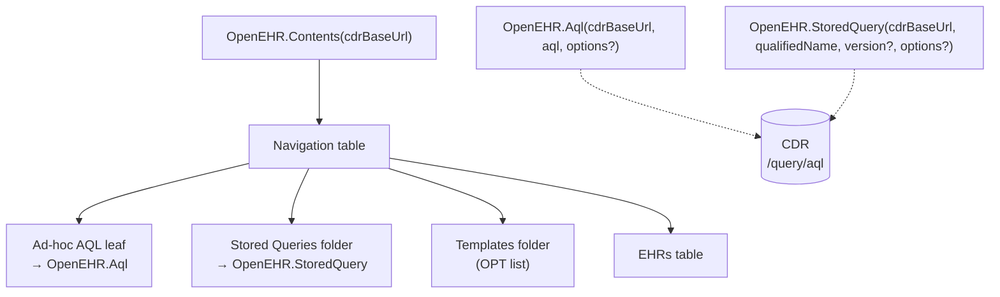

# Function reference

All exported members live under the `OpenEHR.` namespace. This page is the source-of-truth surface for `v0.1.0`.

## Surface map



---

## `OpenEHR.Contents(cdrBaseUrl as text) as table`

Navigation entry point. This is what **Get Data → openEHR (Beta)** invokes.

### Parameters

| Name         | Type | Description                                                                                          |
| ------------ | ---- | ---------------------------------------------------------------------------------------------------- |
| `cdrBaseUrl` | text | Root of the CDR REST API, e.g. `http://localhost:8080/ehrbase/rest/openehr/v1` (no trailing slash). |

### Returns

A `table` decorated as a nav table with four rows:

| Name            | Data shape                                                                                     |
| --------------- | ---------------------------------------------------------------------------------------------- |
| Ad-hoc AQL      | Leaf — opens the **Function** invocation UI binding to `OpenEHR.Aql`.                          |
| Stored Queries  | Folder — one row per registered stored query; each row's `Data` cell is a table of rows.       |
| Templates       | Folder — list of installed OPTs with `template_id`, `concept`, `archetype_id`, `created_on`.   |
| EHRs            | Leaf — table of all `ehr_id`s the caller is authorised to see.                                 |

### Example

```m
Source = OpenEHR.Contents("http://localhost:8080/ehrbase/rest/openehr/v1")
```

---

## `OpenEHR.Aql(cdrBaseUrl, aql, options?) as table`

Executes an ad-hoc AQL query and returns a typed table.

### Parameters

| Name         | Type     | Required | Description                                                                             |
| ------------ | -------- | -------- | --------------------------------------------------------------------------------------- |
| `cdrBaseUrl` | `text`   | yes      | Root of the CDR REST API.                                                               |
| `aql`        | `text`   | yes      | The AQL body. Alias every projected column with `AS`; without it, columns are `#0…#N`.  |
| `options`    | `record` | no       | See [Options](options.md). `PageSize`, `ExpandRmObjects`, `Timeout`, `QueryParameters`. |

### Returns

A `table` whose columns mirror the AQL `SELECT` list. RM-object-shaped columns are flattened per [Schema flattening](#rm-object-flattening) when `ExpandRmObjects = true` (default).

### Errors

| Reason                   | HTTP  | Typical cause                                                                  |
| ------------------------ | ----- | ------------------------------------------------------------------------------ |
| `OpenEHR.AqlError`       | 400   | Invalid AQL — syntax, unknown archetype, path typo.                            |
| `OpenEHR.AuthError`      | 401/403 | Credentials missing or insufficient.                                         |
| `OpenEHR.NotFoundError`  | 404   | Base URL wrong, or query endpoint not exposed by the CDR.                      |
| `OpenEHR.TimeoutError`   | 408   | Query exceeded `Timeout`. Consider adding a `WHERE` clause or a stored query.  |
| `OpenEHR.ConflictError`  | 409   | Vendor-specific.                                                               |
| `OpenEHR.HttpError`      | other | See `Details.response` for the raw body.                                       |

### Example

```m
OpenEHR.Aql(
    "http://localhost:8080/ehrbase/rest/openehr/v1",
    "SELECT
        e/ehr_id/value AS EhrId,
        c/uid/value    AS Uid
     FROM EHR e CONTAINS COMPOSITION c",
    [
        PageSize        = 500,
        ExpandRmObjects = true,
        Timeout         = #duration(0, 0, 2, 0),
        QueryParameters = null
    ]
)
```

---

## `OpenEHR.StoredQuery(cdrBaseUrl, qualifiedName, version?, options?) as table`

Executes a stored (named) query from the CDR's registry.

### Parameters

| Name            | Type     | Required | Description                                                                                 |
| --------------- | -------- | -------- | ------------------------------------------------------------------------------------------- |
| `cdrBaseUrl`    | `text`   | yes      | Root of the CDR REST API.                                                                   |
| `qualifiedName` | `text`   | yes      | Fully-qualified query name, e.g. `org.openehr::compositions`.                               |
| `version`       | `text`   | no       | SemVer. Omit or pass `null` to target the latest version.                                   |
| `options`       | `record` | no       | Same shape as `OpenEHR.Aql`, minus query-body paging knobs (stored queries page server-side in EHRbase). |

### HTTP

```
GET {cdrBaseUrl}/query/{qualifiedName}[/{version}]
```

with `Authorization` + `Accept: application/json`. Query parameters, when supplied, flow through as URL-query values.

### Example

```m
OpenEHR.StoredQuery(
    "http://localhost:8080/ehrbase/rest/openehr/v1",
    "org.openehr::compositions",
    "1.0.0"
)
```

---

## RM-object flattening

When `ExpandRmObjects = true`, columns whose first non-null value is a record-shaped RM type are decomposed to scalar columns. First-non-null is sampled **per column independently**, so sparse populated columns are not dropped.

| RM type         | Flattened columns                                                     |
| --------------- | --------------------------------------------------------------------- |
| `DV_QUANTITY`   | `.magnitude`, `.units`, `.precision`                                  |
| `DV_CODED_TEXT` | `.value`, `.defining_code.terminology_id.value`, `.defining_code.code_string` |
| `DV_TEXT`       | `.value`                                                              |
| `DV_DATE_TIME`  | `.value` (ISO-8601)                                                   |
| `DV_IDENTIFIER` | `.id`, `.issuer`, `.assigner`, `.type`                                |
| `PARTY_SELF`    | `.external_ref.id.value`, `.external_ref.namespace`                   |

Unknown record shapes fall back to `Json.FromValue(.)` text so nothing is silently dropped.

## Never

- **Do not** pass credentials as function arguments — they would persist into saved `.pbix` files. The connector reads them via `Extension.CurrentCredential()` at call time.
- **Do not** build the CDR base URL by string concatenation inside a second query. `Web.Contents` requires a static base URL.

## Related

- [Options reference](options.md)
- [Error codes](error-codes.md)
- [Blood-pressure cookbook](../cookbook/blood-pressure-trend.md)
- [openEHR AQL spec](https://specifications.openehr.org/releases/QUERY/latest/AQL.html)

[← Back to Home](../index.md)
