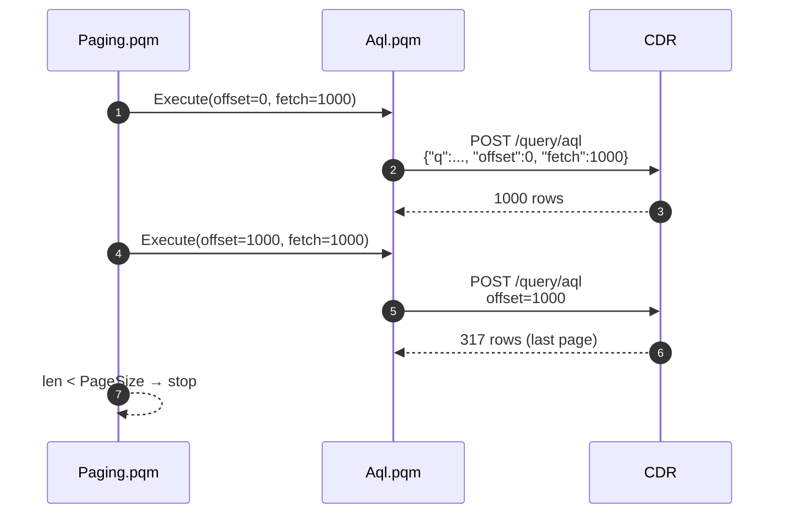

# Options reference

`OpenEHR.Aql` and `OpenEHR.StoredQuery` accept an optional `options` record. Omit the record entirely, or omit any individual field, to get defaults.

## Schema

| Option             | Type       | Default                | Meaning                                                                                                         |
| ------------------ | ---------- | ---------------------- | --------------------------------------------------------------------------------------------------------------- |
| `PageSize`         | `number`   | `1000`                 | Rows per server round-trip during lag-one pagination.                                                           |
| `ExpandRmObjects`  | `logical`  | `true`                 | If `true`, flatten `DV_QUANTITY`, `DV_CODED_TEXT`, `DV_DATE_TIME`, `DV_IDENTIFIER`, `PARTY_SELF`, … to scalars. |
| `Timeout`          | `duration` | `#duration(0,0,2,0)`   | Per-request timeout. Applied to every page fetch.                                                               |
| `QueryParameters`  | `record`   | `null`                 | Values substituted into `:name` placeholders in the AQL (serialised as `query_parameters`).                     |

All four fields are individually optional.

## `PageSize`

Lag-one pagination: the connector asks for `PageSize` rows, and keeps going until a page returns fewer rows than requested.



Tuning:

- **Smaller (250–500)**: lower memory pressure, smoother progress bar, but more round-trips.
- **Default (1000)**: balanced.
- **Larger (2500–5000)**: fewer round-trips, but larger payloads. EHRbase can return 5000-row pages comfortably.

## `ExpandRmObjects`

Record-shaped columns become multiple scalar columns. Column names are the RM path joined with `.` — e.g. `DV_QUANTITY` → `Systolic.magnitude`, `Systolic.units`, `Systolic.precision`.

Setting this `false`:

- Preserves record cells as-is — useful when a downstream step needs the full RM object.
- Round-trips slightly faster (no per-column sampling).
- Makes the result schema unstable across refreshes if sparse columns sometimes have records and sometimes nulls.

## `Timeout`

Wall-clock ceiling for a single `Web.Contents` call. If a page exceeds it, the connector raises `OpenEHR.TimeoutError` and abandons the query (no partial table is returned — Power BI treats the dataset as failed).

The default of **2 minutes** is already generous for page-level calls; increase only if the CDR is unusually slow or you are in a proof-of-concept environment.

## `QueryParameters`

A record whose fields become `:name` substitutions in the AQL. Values go into the request body's `query_parameters` (underscore form, per current openEHR spec).

```m
OpenEHR.Aql(cdr,
    "SELECT c/uid/value FROM EHR e CONTAINS COMPOSITION c
     WHERE c/context/start_time/value >= :rangeStart",
    [ QueryParameters = [ rangeStart = "2024-01-01T00:00:00Z" ] ]
)
```

Use cases:

- **[Incremental refresh](../cookbook/incremental-refresh.md)** — wire `RangeStart` / `RangeEnd` into AQL time filters.
- **Multi-tenant dashboards** — parameterise on `:tenantId` to let one report serve many tenants.
- **Avoid string-concatenating AQL** — placeholders are less error-prone and sidestep escaping concerns.

!!! warning "Underscore, not hyphen"
    Earlier drafts of the openEHR spec used `query-parameters` (hyphen). The connector always emits `query_parameters` (underscore), matching the current spec. Custom CDRs must accept that form.

## Precedence

All options default to their `null` interpretation if a field is missing or explicitly `null`. Passing an empty record `[]` is identical to omitting the argument.

## Related

- [Functions](functions.md)
- [Error codes](error-codes.md)
- [Incremental refresh cookbook](../cookbook/incremental-refresh.md)

[← Back to Home](../index.md)
